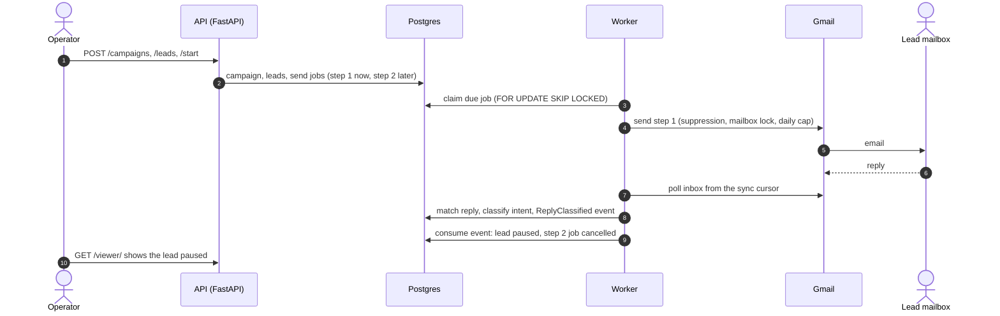

# OutboxLab

A small cold-email outreach engine built as a proof of work: a campaign sends a short sequence from a Gmail mailbox, a reply is matched and classified, and the lead is paused before the follow-up goes out. The code is a modular monolith with DDD bounded contexts and ports, on a **Postgres-only operational stack** — the job queue, locks, send caps, suppression list and outbox are tables and SQL, with no Redis and no broker. An LLM classifier sits behind a port with a deterministic fallback, so the demo never depends on a vendor.

**Status: Step 4 of 7 — hardened demo, README v1.** Next: a Go sender on the same job contract, MCP access, metrics. See [Roadmap](#roadmap).

## Demo path

1. Seed a workspace and its Gmail mailbox; the worker records the mailbox's sync cursor.
2. Create a campaign with two steps (the follow-up after a delay), add a lead mailbox you control, start the campaign.
3. The worker claims the step-1 job and sends it through the Gmail API, after the suppression check, the mailbox lock and the daily cap.
4. The lead replies. The worker polls the inbox, matches the reply to the sent message, and classifies the intent.
5. The campaign consumer pauses the lead and cancels the follow-up. The viewer at `/viewer/` shows `sent` turn into `paused` within one poll.



Commands for a live run are in [Run the demo](#run-the-demo).

## What works

- **Campaigns** — ordered steps (`subject`, `body`, `delay_seconds`) and leads. Lead state (`pending → scheduled → sent → done`, or `paused` / `failed`) changes only through the `Campaign` aggregate. Starting a campaign is idempotent.
- **Send queue** — `campaign__send_jobs`, claimed with `SELECT … FOR UPDATE SKIP LOCKED` and a 5-minute lease. Each job runs in its own transaction; errors retry with backoff and fail the lead after three attempts. The payload is frozen in [`contracts/jobs/send_job/v1.json`](contracts/jobs/send_job/v1.json).
- **Sending guards** — before every send: the recipient is not suppressed, the mailbox takes a Postgres advisory lock, and today's sent count (UTC day) is under the mailbox's `daily_send_cap` (default 20).
- **Replies** — the worker polls Gmail with a sync cursor and matches a reply by `In-Reply-To` / `References`, then thread, then a normalised subject from the same address. The classifier reads the de-quoted body and returns `positive · negative · ooo · unsubscribe · unclear`.
- **Bounces and unsubscribes** — delivery-status notifications are flagged in the Gmail adapter, skip the classifier, suppress the address and fail the lead. An unsubscribe reply also suppresses the address.
- **Outbox and consumer** — `InboundReceived`, `ReplyMatched` and `ReplyClassified` are written in the same transaction as the state change ([schemas](contracts/events/)). The campaign context consumes `ReplyClassified` with a processed-events set: at-least-once delivery, one effect per event.
- **Access** — workspace API keys (`Authorization: Bearer olab_…`). In production a key is the only way in; locally the `X-Workspace-Id` header also works.
- **Viewer** — `/viewer/`: campaigns, leads with state, stop reason, reply intent and next send time, workspace counts and recent events, refreshed every 5 seconds.

## Architecture

Bounded contexts under `apps/api/app/contexts/`, each with `domain / application / infrastructure / presentation`:

| Context | Owns |
|---|---|
| `identity` | workspaces (the tenant registry) and workspace API keys |
| `mailbox` | the connected Gmail mailbox, its sync cursor and daily send cap |
| `messaging` | outbound / inbound messages, reply matching, intent, bounce detection, suppressions, sending guards, outbox events |
| `campaign` | campaigns, steps, leads and their state machine; the send-job queue; the reply consumer |

- **Ports at the borders.** Domain and application code depend on `Protocol` ports; Gmail, the LLM SDKs and SQLAlchemy live in `infrastructure/`. Only infrastructure may import another context.
- **Tenant isolation in the database.** Every tenant table has row-level security keyed by a per-transaction workspace setting; tests run as a non-superuser role so the policies are exercised.
- **Every table is prefixed with its context** (`campaign__send_jobs`, `messaging__suppressions`, …).

More: [architecture overview](docs/architecture/overview.md), [infrastructure](docs/architecture/infrastructure.md), [decision records](docs/adr/README.md), [the 7-step plan](docs/plan/README.md).

## Trade-offs and what is intentionally not built

- **Postgres is the whole ops stack.** Latency is the poll interval (seconds). The queue or the rate limiter moves out only after measuring queue latency, lock contention and pool saturation.
- **At-least-once sending.** A send still in flight when its lease expires, or a commit that fails after Gmail accepted the message, can be sent twice.
- **One worker, one workspace.** The worker serves `MAILBOX_WORKSPACE_ID`; a multi-tenant worker and an OAuth web flow are parked.
- **Minimal auth.** One kind of credential: a workspace API key issued from the command line. No users, sessions, key management or rotation.
- **Not built:** bounce classes and a mailbox health score, follow-ups threaded into the same Gmail conversation, campaign pause / resume, templating, CSV import, a create / edit UI, metrics (Step 7).

**Known gaps**

- A delivery failure that cannot be matched to a sent message is stored but suppresses nothing.
- Bounce detection is tested on fixtures shaped like Gmail notifications, not on a live bounce.
- `POST /send-test-email` is not idempotent.
- If Gmail's history window has expired, the receiver re-baselines and skips the gap (logged as a warning).

## Stack

- API: FastAPI, Pydantic v2, SQLAlchemy 2.0 async, Alembic (Python 3.14, uv). The API also serves the viewer.
- Worker: a separate process from the same project (`python -m app.entrypoints.worker`) — polls Gmail, dispatches classified replies, drains send jobs.
- Database: Postgres 17 locally, Neon in production.
- Deploy: fly.io; CI on GitHub Actions.

## Layout

```
apps/api/        FastAPI app, worker entrypoint, Alembic migrations, tests
                 app/contexts/<bc> · app/shared · app/entrypoints (api, worker, seed, issue_api_key)
contracts/       versioned JSON Schemas: events/ and jobs/
infra/
  dev/           docker-compose, dev Dockerfile, Caddy proxy, demo_reset.sql
  prod/          prod Dockerfile, fly.toml files
  make/          shared make fragment (deploy, check-leaks)
scripts/         smoke.sh
docs/            plan (one page per step), architecture notes, ADRs
```

## Roadmap

1. ~~[Step 0](docs/plan/step-0-local-dev-stack.md) — local dev stack, fly deploy path~~
2. ~~[Step 1](docs/plan/step-1-walking-skeleton.md) — walking skeleton: identity context, workspaces, CI, live URL~~
3. ~~[Step 2](docs/plan/step-2-real-email-loop.md) — real email loop: Gmail send, inbox polling, reply matching, intent classification, outbox~~
4. ~~[Step 3](docs/plan/step-3-campaign-state-machine.md) — campaign state machine, send queue, bounce and unsubscribe suppression, daily caps~~
5. ~~[Step 4](docs/plan/step-4-hardening-and-demo.md) — hardening and demo: API keys, viewer, smoke tests, README v1~~
6. [Step 5](docs/plan/step-5-go-sender-extraction.md) — Go sender on the same job contract.
7. [Step 6](docs/plan/step-6-mcp-server.md) — MCP server over the API (OpenAPI-as-MCP).
8. [Step 7](docs/plan/step-7-observability.md) — observability, README v2.

## First-time setup

Prereqs: a Docker engine, `mkcert` (`brew install mkcert nss`), `make`.

```bash
make env         # copy .env.example to .env
# edit .env: set API_DOMAIN.
# For the live email loop also set GOOGLE_CLIENT_ID, GOOGLE_CLIENT_SECRET,
# GOOGLE_REFRESH_TOKEN, GMAIL_USER_EMAIL, MAILBOX_WORKSPACE_ID
# (tests and the API run without them).
make certs       # TLS certificate for your API domain
make hosts-add   # /etc/hosts entry (sudo)
make up          # start containers
make migrate     # apply Alembic migrations
make seed        # default workspace + mailbox (idempotent; mailbox only if GMAIL_USER_EMAIL is set)
make test        # unit + integration tests
```

The Gmail refresh token needs the `gmail.send` and `gmail.readonly` scopes. In an OAuth app in "Testing" mode it lives about a week, so mint it right before a live run.

## Run the demo

Use a **separate** lead mailbox you control; the worker ignores mail sent by the polled mailbox itself.

1. `make up`, `make migrate`, `make seed`. Wait until `GET /debug/state` shows a non-null `mailbox_last_sync_cursor`.
2. Open `https://<api-domain>/viewer/` and connect with the workspace id (local) or an API key (`make api-key`).
3. Either run `make smoke SMOKE_LEAD_EMAIL=<lead-address>`, which drives steps 4–6 and waits for you to reply, or use the API directly:

   ```bash
   API=https://<api-domain>
   AUTH="Authorization: Bearer <api-key>"
   CAMPAIGN=$(curl -s -X POST "$API/campaigns" -H "$AUTH" -H 'content-type: application/json' \
     -d '{"name":"Demo","steps":[{"subject":"Quick question","body":"Hi!","delay_seconds":0},{"subject":"Re: Quick question","body":"Following up","delay_seconds":600}]}' \
     | python3 -c 'import sys, json; print(json.load(sys.stdin)["id"])')
   curl -s -X POST "$API/campaigns/$CAMPAIGN/leads" -H "$AUTH" -H 'content-type: application/json' -d '{"emails":["<lead-address>"]}'
   curl -s -X POST "$API/campaigns/$CAMPAIGN/start" -H "$AUTH"
   ```

4. The viewer shows the lead `sent` with a next send time.
5. Reply from the lead mailbox, for example "Yes, interested — let's talk".
6. Within one poll (about 20 seconds) the lead turns `paused` with intent `positive`, and no send is scheduled.

`make demo-reset` shows the campaign and message rows of the seeded workspace; `make demo-reset CONFIRM=yes` deletes them and keeps the workspace, the mailbox and its sync cursor.

## API

Every route except `/health`, `/version` and `/viewer/` needs a workspace: `Authorization: Bearer <api-key>`, or `X-Workspace-Id: <uuid>` outside production.

| Route | What it does |
|---|---|
| `GET /health`, `GET /version` | liveness; version, git SHA, environment |
| `GET /viewer/` | the read-only state viewer |
| `GET /workspaces/me` | the caller's workspace |
| `POST /campaigns` | create a campaign with steps (uses the workspace's mailbox) |
| `POST /campaigns/{id}/leads` | add leads; scheduled at once if the campaign is active |
| `POST /campaigns/{id}/start` | start the campaign (idempotent) |
| `GET /campaigns`, `GET /campaigns/{id}` | campaigns with lead counts; one campaign with steps and leads |
| `GET /debug/state` | the workspace's message, lead and job counts, sync cursor, recent events |
| `POST /send-test-email` | one email outside any campaign — non-production only; 409 for a suppressed recipient, 429 for a busy or capped mailbox |

## Daily commands

```bash
make up / make down     # start / stop
make logs               # tail all services
make migrate            # apply pending migrations
make test               # pytest
make typecheck          # pyright
make lint / make format # ruff check / fix
make smoke-readonly     # read-only smoke test, sends no email
make api-key            # print a new workspace API key once
make ready              # leak check + ruff + pyright + tests
make shell-api / shell-worker / shell-db
make clean              # stop and drop volumes
```

`make help` lists everything.

**Troubleshooting.** If host port `55432` is taken by another Postgres, start the stack with a compose override file that replaces the postgres `ports` (`ports: !override`) with a free port; the containers still reach the database as `postgres:5432`. The proxy on ports 80 / 443 is not needed for tests.

## Adding a migration

```bash
# edit ORM models in apps/api/app/contexts/<bc>/infrastructure/db/models.py
make migration name="describe the change"
# review apps/api/alembic/versions/<new_file>.py
make migrate
```

Migrations only move forward. Tables are named `{bc}__{table}`; the prefix goes into `__tablename__`, the `ForeignKey` target and the migration. New tenant tables enable and force row-level security with the `workspace_isolation` policy.

## RLS app role

Tests `SET LOCAL ROLE outboxlab_app` so row-level security applies (it does not apply to a superuser).

- **Local:** created by `infra/postgres/bootstrap_app_role.sql`, mounted into the postgres init directory (runs once on an empty data directory; `make clean` to re-run).
- **CI:** a workflow step pipes the same SQL through `psql` before migrations.
- **Production (Neon):** run the same SQL once against the database.

## CI

Every pull request runs **api-tests** (Postgres 17 service, role bootstrap, migrations, seed, pytest), **typecheck** (pyright), **lint** (ruff format check + check) and **leak-check** (no hostnames in tracked files). On a push to `main`, **deploy-api** ships the API to fly.io after all four pass, inside the `production` environment; it needs a `FLY_API_TOKEN` secret (`fly tokens create deploy -a outboxlab-api`).

## Deploy (fly.io)

Merging to `main` deploys the API. The `release_command` in `infra/prod/fly/api.fly.toml` runs `alembic upgrade head` before serving machines start, so a broken migration fails the deploy.

```bash
# one time: app role on Neon, then secrets for the API
psql "$NEON_DIRECT_URL" -f infra/postgres/bootstrap_app_role.sql
fly secrets set -a outboxlab-api DATABASE_URL="postgresql+asyncpg://<neon-url>" API_DOMAIN="<api-domain>"

# by hand, when needed
make deploy          # API
make deploy-worker   # worker; needs its own secrets, see infra/prod/fly/worker.fly.toml
```

The deployed API accepts only API keys. Issue one with `python -m app.entrypoints.issue_api_key`, run with `DATABASE_URL` and `MAILBOX_WORKSPACE_ID` set. Real sends from production also need the worker app deployed.

## Package managers

Python: `uv` only.
